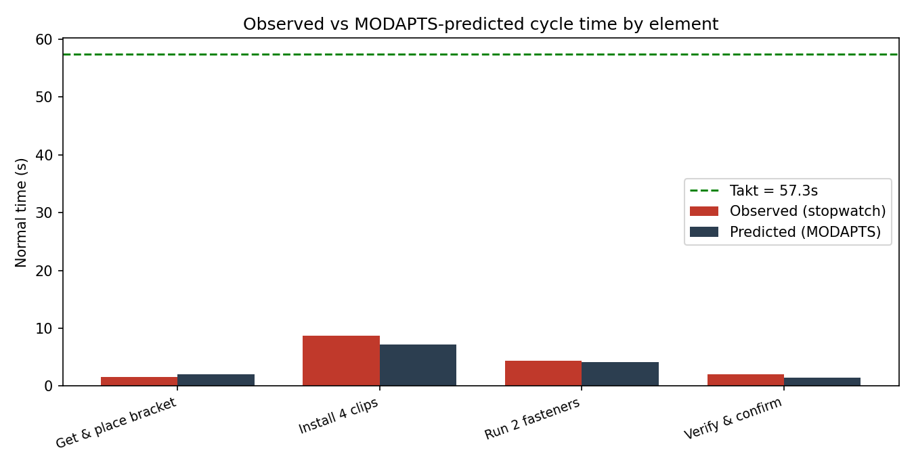

# modapts-time-study



**Stopwatch time studies + MODAPTS predetermined times + takt analysis — and the comparison between them.**

A Python toolkit for manufacturing and industrial engineers that answers three questions every assembly station must face:

1. **What does the process actually take?** — interactive stopwatch time study with performance rating, PF&D allowances, and a statistical sample-size check.
2. **What *should* it take?** — MODAPTS (Modular Arrangement of Predetermined Time Standards) analysis from motion notation, at 0.129 s/MOD.
3. **Can it meet demand?** — takt time from shift pattern and demand, station loading verdicts, and theoretical operator count.

Then it puts observed and predicted side by side, element by element, and flags where reality deviates from the engineered method — the fastest way to find method drift, layout problems, and rating errors.

## Why compare observed vs MODAPTS?

| Signal | Likely cause |
|---|---|
| Variance within ±10% | Method followed, rating sane — trust the standard |
| Observed ≫ predicted | Method deviation, waiting, long reaches, poor layout |
| Observed ≪ predicted | Rating error, or motions engineered out since analysis |

A stopwatch tells you *what happened*; MODAPTS tells you *what the method is worth*. The gap between them is where process engineering lives.

## Install

```bash
git clone https://github.com/Fitsumtf/modapts-time-study
cd modapts-time-study
pip install -e ".[charts]"   # charts extra pulls matplotlib
pytest                        # 16 tests
```

## Quick start

### Library

```python
from modapts_time_study import (
    analyze_element, TimeStudy, TaktInput, takt_time_s,
    compare_elements, report, chart,
)

# Predicted: reach (whole arm) + grasp, move + precise place, eye check
pred = analyze_element("Get & place bracket", "M4G1 M4P5 E2")
print(pred.mods, pred.seconds)   # 16 MOD, 2.064 s normal

# Observed: 10 stopwatch cycles, operator rated at 100%
obs = TimeStudy.from_times("Get & place bracket",
                           [1.60, 1.48, 1.55, 1.71, 1.52,
                            1.66, 1.49, 1.58, 1.62, 1.54])

# Takt: 2 shifts x 480 min, 50 min planned downtime each, 900 units/day
takt = takt_time_s(TaktInput(480, 50, 2, 900))

comps = compare_elements([obs], [pred])
print(report(comps, takt_s=takt))
chart(comps, takt_s=takt, path="comparison.png")
```

### CLI

```bash
# Live lap-timer time study (Enter = end of cycle)
python -m modapts_time_study.cli timer "Install 4 clips" --cycles 10 --rating 105

# Evaluate a MODAPTS string (supports repeat groups)
python -m modapts_time_study.cli modapts "4(M3G3 M3P5)"

# Takt
python -m modapts_time_study.cli takt --shift-min 480 --downtime-min 50 --shifts 2 --demand 900
```

### Worked example

`examples/harness_bracket_station.py` walks a four-element GA station
(bracket, clips, fasteners, verify) through the full loop: MODAPTS
prediction → observed study → takt → comparison report → chart.

```
Element               Observed(s)  MODAPTS(s)  Delta(s)   Var %  Flag
----------------------------------------------------------------------
Get & place bracket          1.57        2.06     -0.49   -23.7  OBSERVED FASTER - check rating or motion content
Install 4 clips              8.66        7.22      1.44    19.9  OBSERVED SLOWER - check method/layout/waiting
...
```

## MODAPTS notation supported

Movement `M1 M2 M3 M4 M5` · Get `G0 G1 G3` · Put `P0 P2 P5` ·
Auxiliary `L1 E2 R2 D3 A4 C4 F3 J2` · Body `W5 B17 S30` ·
Repeat groups `4(M3G3 M3P5)` · Frequency weighting per cycle.

> MODAPTS is a trademark of the International MODAPTS Association. Class
> values here are the published standard values; formal certification is
> recommended before using outputs for production rate-setting.

## Statistical rigor

- Coefficient of variation per element (process stability signal)
- Sample-size check: cycles required for ±5% precision at 95% confidence
- Explicit separation of observed → normal (rating) → standard (PF&D)

## Related projects

- [`pfmea-doc-gen`](https://github.com/Fitsumtf/pfmea-doc-gen) — PFMEA/8D Word document generator
- [`design-review-miner`](https://github.com/Fitsumtf/design-review-miner) — ML similarity search over past design issues

## Author

Fitsum Taye Feyissa, PhD — manufacturing & process engineering.
[linkedin.com/in/fitsumfeyissa](https://linkedin.com/in/fitsumfeyissa)
